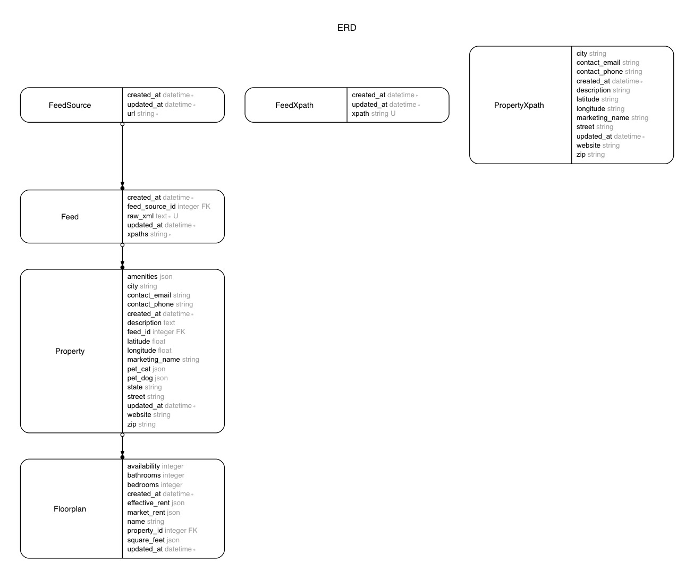

# Apts

## Environment / gems

```
Ruby 2.3.1
Rails 5.0.0
Devise
etc
```

---

## Models



---

## Get started

```bash
rails db:create
rails db:migrate
rails db:seed
```

Visit localhost:3000

```yml
user:
  email:    "user@example.com"
  password: "password"
admin:
  email:    "admin@example.com"
  password: "password"
```

---

## Gems / Libraries

#### XML parsing
- [Nokogiri tutorials](http://www.nokogiri.org/tutorials/parsing_an_html_xml_document.html)
- [Nokogiri wiki](https://github.com/sparklemotion/nokogiri/wiki)
- [Nokogiri rubydoc](http://www.rubydoc.info/github/sparklemotion/nokogiri/Nokogiri/XML/Document)
